#  TP3 — Architecture 3-Tiers : Vagrant + Spring Boot + MySQL + React/Nginx


> Déploiement d'une architecture **3-tiers** complète :
> `server-front` (Angular + Nginx) → `server-back` (Spring Boot) → `server-dba` (MySQL 8)

```
Flux de données :
[Navigateur] ──HTTP:80──▶ [Nginx/Angular] ──API:8080──▶ [Spring Boot] ──SQL:3306──▶ [MySQL]
```

---

##  Structure du projet

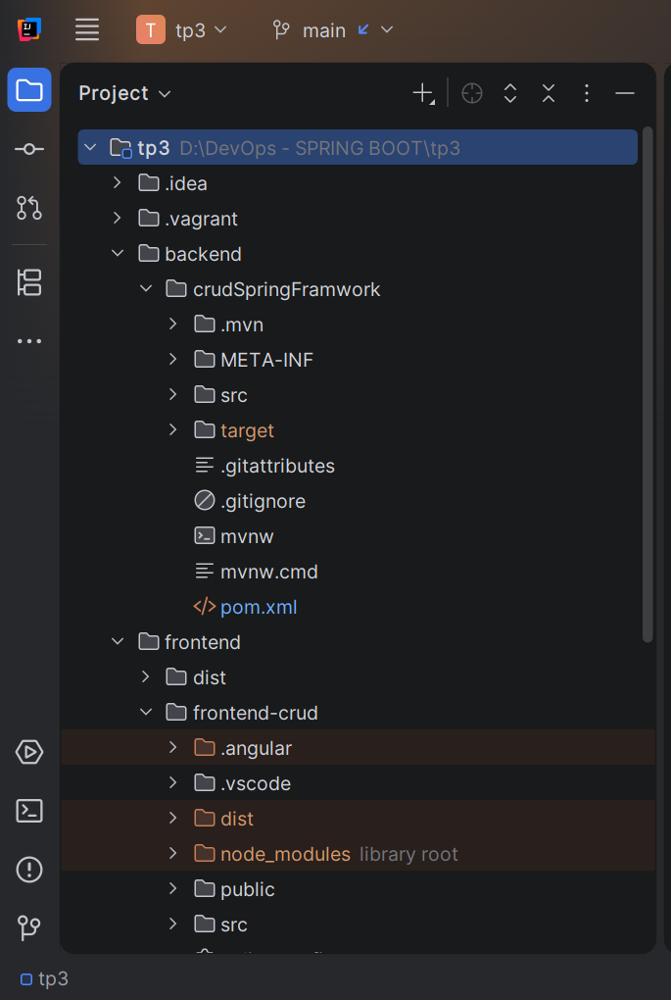 
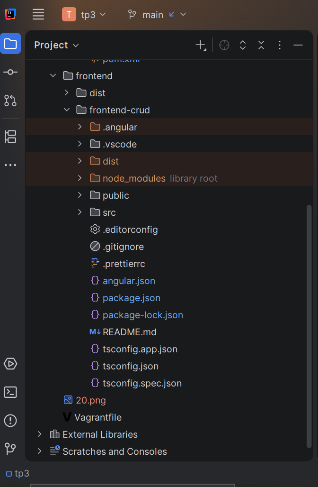 

---

## Création des 3 VMs Vagrant

### Vagrantfile

```ruby
# -*- mode: ruby -*-
# vi: set ft=ruby :

Vagrant.configure("2") do |config|
    # Box de base Ubuntu 20.04
    config.vm.box = "ubuntu/focal64"
    config.vm.box_check_update = false
  
    # Machine : server-back (backend Spring Boot)
 
    config.vm.define "server-back" do |back|
      back.vm.hostname = "server-back"
      back.vm.network "private_network", ip: "192.168.56.10"
      # Redirection du port pour accéder à l'application (si elle tourne sur 8080)
      back.vm.network "forwarded_port", guest: 8080, host: 8080
      back.vm.provider "virtualbox" do |vb|
        vb.memory = "2048"
        vb.cpus = 2
        vb.name = "server-back"
      end
      # Dossier partagé pour le projet backend (optionnel)
      back.vm.synced_folder "./backend", "/vagrant/backend"
    end
  

    # Machine : server-dba (MySQL)
  
    config.vm.define "server-dba" do |dba|
      dba.vm.hostname = "server-dba"
      dba.vm.network "private_network", ip: "192.168.56.11"
      # Redirection du port MySQL (optionnel, pour accès depuis l'hôte)
      dba.vm.network "forwarded_port", guest: 3306, host: 3306
      dba.vm.provider "virtualbox" do |vb|
        vb.memory = "1024"
        vb.cpus = 1
        vb.name = "server-dba"
      end
    end
  
   
    # Machine : server-front (Nginx + frontend)
   
    config.vm.define "server-front" do |front|
      front.vm.hostname = "server-front"
      front.vm.network "private_network", ip: "192.168.56.12"
      # Redirection du port 80 pour accéder au frontend
      front.vm.network "forwarded_port", guest: 80, host: 8081
      front.vm.provider "virtualbox" do |vb|
        vb.memory = "1024"
        vb.cpus = 1
        vb.name = "server-front"
      end
      # Dossier partagé pour le projet frontend (build)
      # front.vm.synced_folder "./frontend", "/vagrant/frontend"
      front.vm.synced_folder "./frontend/dist", "/vagrant/frontend-dist"
    end
  end
    
```

### Démarrage

```bash
vagrant up
vagrant status
```

Résultat attendu :

```
server-back    running (virtualbox)
server-dba     running (virtualbox)
server-front   running (virtualbox)
```

| Capture | Description |
|---------|-------------|
| 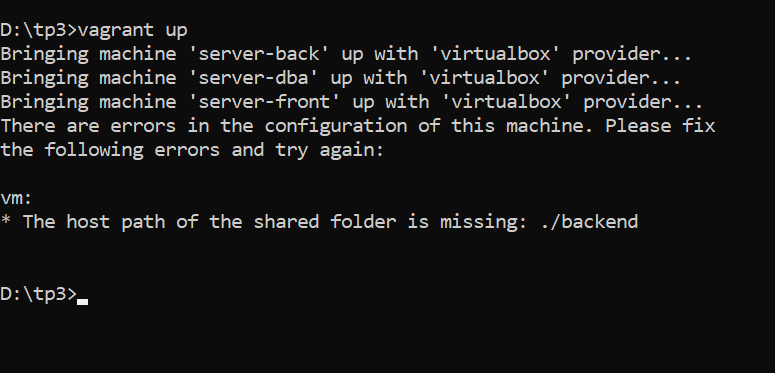 | `vagrant up` — provisioning des 3 VMs |


---

##  server-dba : Installation MySQL

### Connexion SSH à server-dba 

 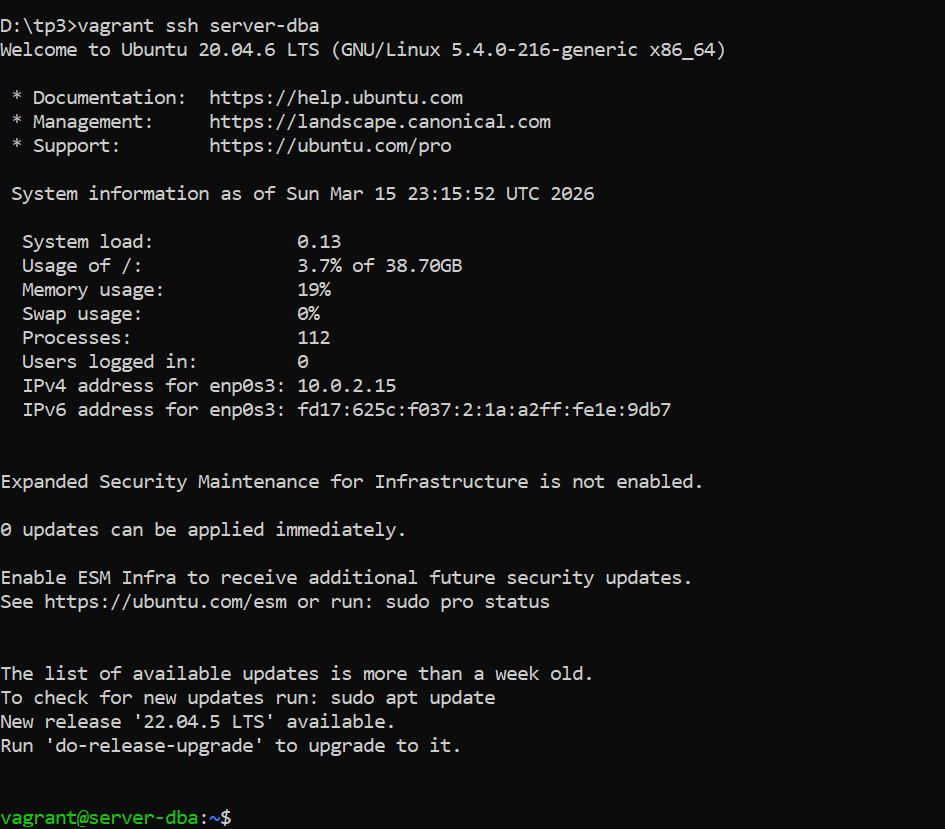 

### Vérification MySQL

## Installation de MySQL
 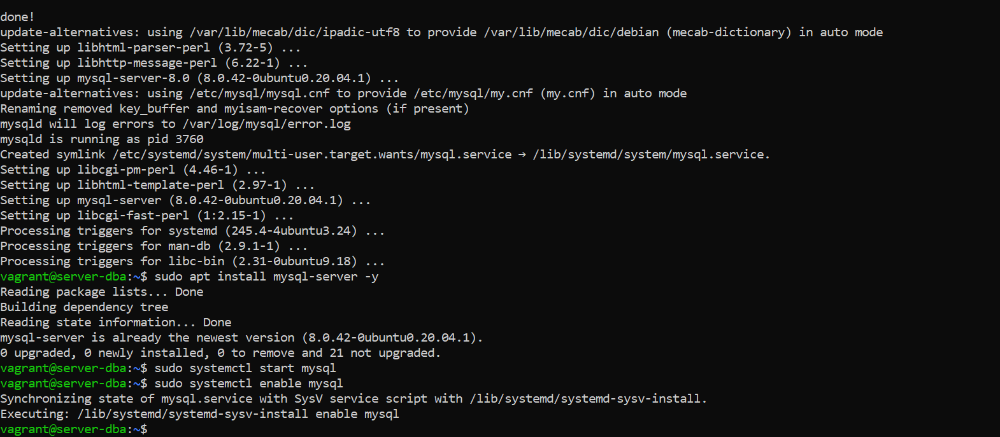
 
## Éditez le fichier de configuration
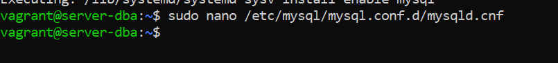

## Création de la base
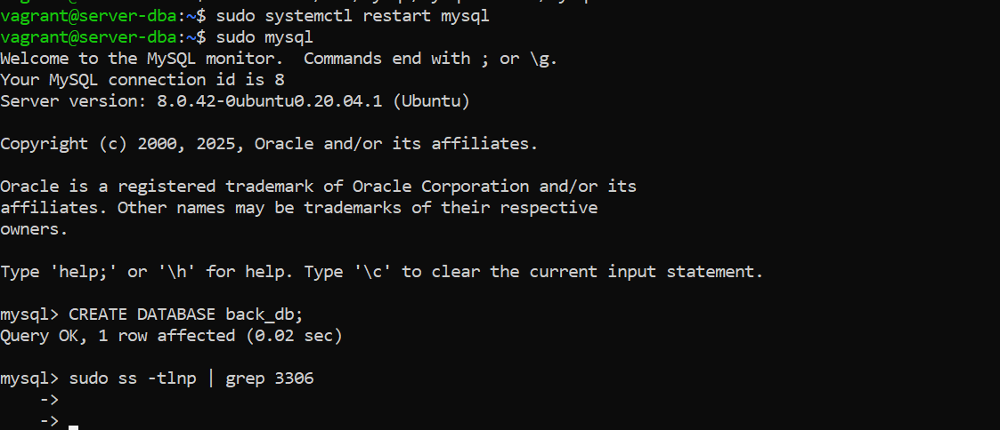

## Installer JDK 17 et Maven

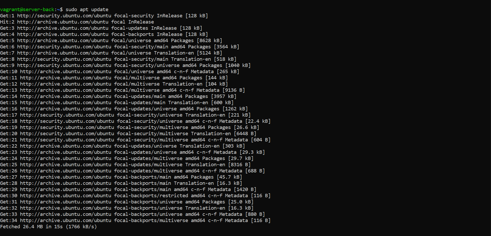
## sudo apt install openjdk-17-jdk maven -y-Installer JDK 17 et Maven
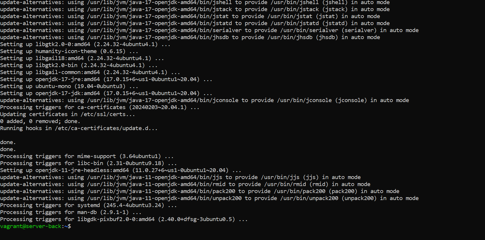

## Compiler et lancer l'application
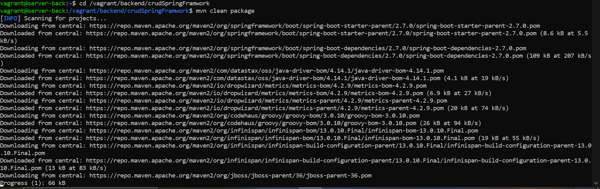
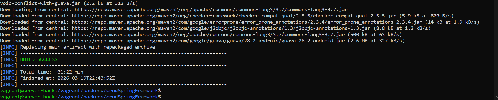
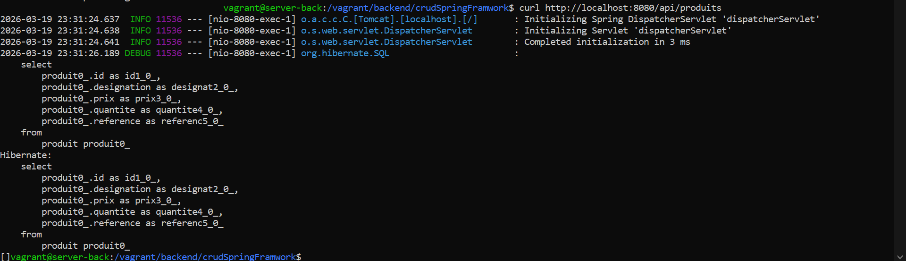

---

### Application Spring Boot

#### `pom.xml`

```
<?xml version="1.0" encoding="UTF-8"?>
<project xmlns="http://maven.apache.org/POM/4.0.0"
         xmlns:xsi="http://www.w3.org/2001/XMLSchema-instance"
         xsi:schemaLocation="http://maven.apache.org/POM/4.0.0 
         https://maven.apache.org/xsd/maven-4.0.0.xsd">
    <modelVersion>4.0.0</modelVersion>

    <parent>
        <groupId>org.springframework.boot</groupId>
        <artifactId>spring-boot-starter-parent</artifactId>
        <version>2.7.0</version>
        <relativePath/>
    </parent>

    <groupId>sn.dev</groupId>
    <artifactId>crudProduit</artifactId>
    <version>0.0.1-SNAPSHOT</version>
   
    <packaging>jar</packaging>
    <name>crudProduit</name>
    <description>Application Spring Boot avec MySQL (backend autonome)</description>

    <properties>
        <java.version>17</java.version>
    </properties>

    <dependencies>
        
        <dependency>
            <groupId>org.springframework.boot</groupId>
            <artifactId>spring-boot-starter-web</artifactId>
        </dependency>

       
        <dependency>
            <groupId>org.springframework.boot</groupId>
            <artifactId>spring-boot-starter-data-jpa</artifactId>
        </dependency>

        <!-- Driver MySQL -->
        <dependency>
            <groupId>mysql</groupId>
            <artifactId>mysql-connector-java</artifactId>
            <scope>runtime</scope>
        </dependency>

       
        <dependency>
            <groupId>org.springframework.boot</groupId>
            <artifactId>spring-boot-starter-thymeleaf</artifactId>
        </dependency>

       
        <dependency>
            <groupId>org.springframework.boot</groupId>
            <artifactId>spring-boot-starter-validation</artifactId>
        </dependency>

       
        <dependency>
            <groupId>org.springframework.boot</groupId>
            <artifactId>spring-boot-starter-test</artifactId>
            <scope>test</scope>
        </dependency>
    </dependencies>

    <build>
      
        <finalName>crudProduit</finalName>
        <plugins>
            <plugin>
                <groupId>org.springframework.boot</groupId>
                <artifactId>spring-boot-maven-plugin</artifactId>
            </plugin>
        </plugins>
    </build>
</project>
```

#### `application.properties`

```properties
spring.application.name=crudProduit
spring.datasource.url=jdbc:mysql://192.168.56.11:3306/back_db?useSSL=false&serverTimezone=UTC&allowPublicKeyRetrieval=true
spring.datasource.username=backuser
spring.datasource.password=password123

spring.jpa.hibernate.ddl-auto=update
spring.jpa.show-sql=true
spring.jpa.properties.hibernate.format_sql=true
spring.jpa.database-platform=org.hibernate.dialect.MySQL8Dialect

spring.thymeleaf.cache=false

logging.level.org.hibernate.SQL=DEBUG
logging.level.org.hibernate.type.descriptor.sql.BasicBinder=TRACE
```

#### `Structure du projet back

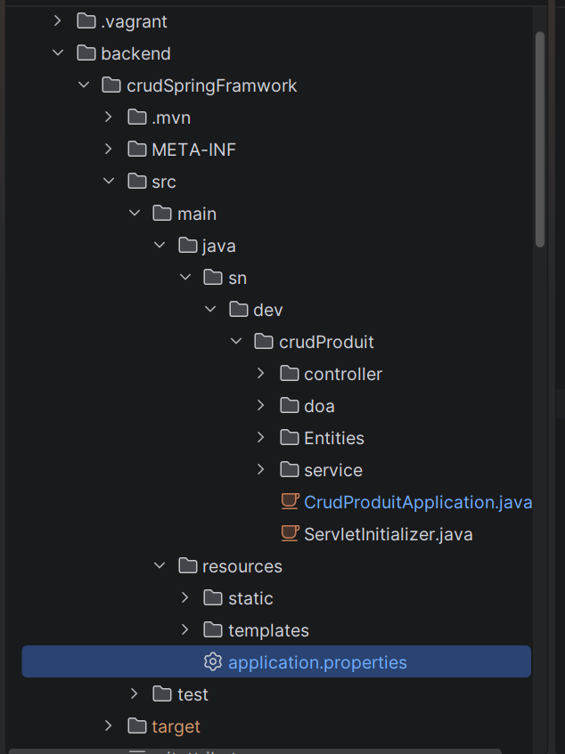
    

## server-front : Angular & Nginx

### Connexion SSH

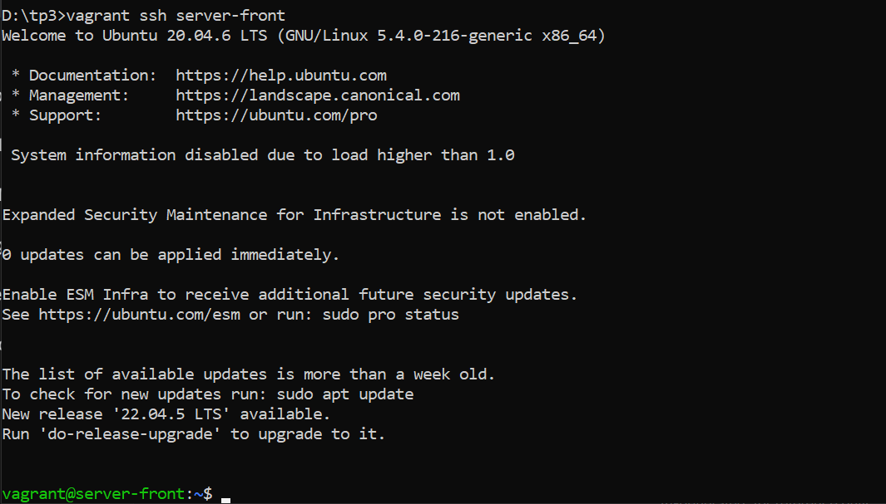

### Vérification Nginx

## Installation de Nginx et redemarrer Nginx

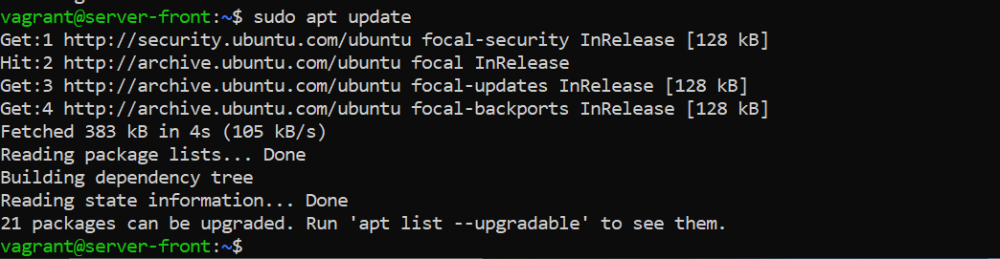
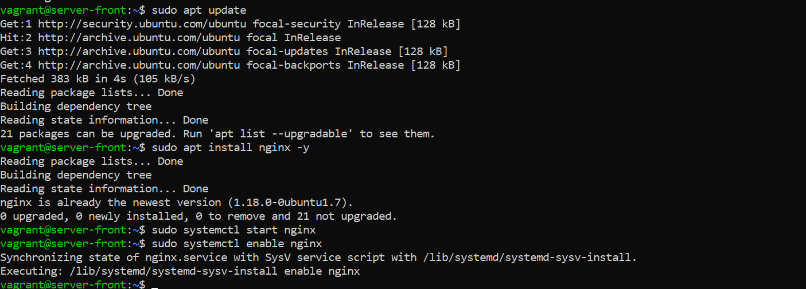
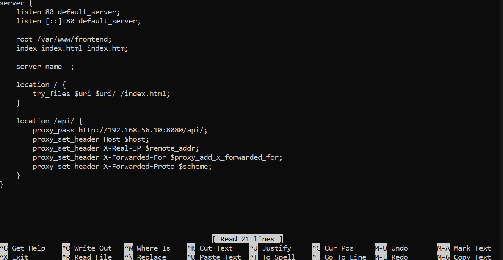
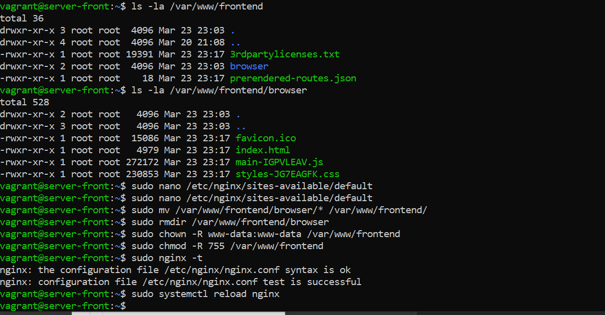


---

### Application Angular

#### `package.json`

```json
{
  "name": "tp3-frontend",
  "version": "1.0.0",
  "scripts": {
    "dev":   "vite",
    "build": "vite build"
  },
  "dependencies": {
    "react":     "^18.2.0",
    "react-dom": "^18.2.0",
    "axios":     "^1.6.0"
  },
  "devDependencies": {
    "@vitejs/plugin-react": "^4.0.0",
    "vite": "^5.0.0"
  }
}
```

#### `vite.config.js`

```javascript
import { defineConfig } from 'vite'
import react from '@vitejs/plugin-react'

export default defineConfig({
  plugins: [react()],
  server: {
    proxy: {
      '/api': {
        target: 'http://192.168.56.10:8080',
        changeOrigin: true
      }
    }
  }
})
```

#### `src/App.jsx`

```jsx
import ProduitList from './components/ProduitList'
import './App.css'

export default function App() {
  return (
    <div className="app">
      <header>
        <h1>Gestion des Produits</h1>
        <p>server-front → server-back → server-dba</p>
      </header>
      <main>
        <ProduitList />
      </main>
    </div>
  )
}
```

#### `src/components/ProduitList.jsx`

```jsx
import { useEffect, useState } from 'react'
import axios from 'axios'

const API = '/api/produits'

export default function ProduitList() {
  const [produits, setProduits] = useState([])
  const [form, setForm]         = useState({ nom:'', description:'', prix:'', stock:'' })
  const [loading, setLoading]   = useState(true)
  const [error, setError]       = useState(null)

  const fetchProduits = async () => {
    try {
      setLoading(true)
      const res = await axios.get(API)
      setProduits(res.data)
    } catch (e) {
      setError('Impossible de contacter le backend (192.168.56.10:8080)')
    } finally {
      setLoading(false)
    }
  }

  useEffect(() => { fetchProduits() }, [])

  const handleSubmit = async (e) => {
    e.preventDefault()
    await axios.post(API, { ...form, prix: parseFloat(form.prix), stock: parseInt(form.stock) })
    setForm({ nom:'', description:'', prix:'', stock:'' })
    fetchProduits()
  }

  const handleDelete = async (id) => {
    if (!confirm('Supprimer ce produit ?')) return
    await axios.delete(`${API}/${id}`)
    fetchProduits()
  }

  if (loading) return <p className="loading">Chargement...</p>
  if (error)   return <p className="error">{error}</p>

  return (
    <div>
      <table>
        <thead>
          <tr>
            <th>ID</th><th>Nom</th><th>Description</th>
            <th>Prix (€)</th><th>Stock</th><th>Action</th>
          </tr>
        </thead>
        <tbody>
          {produits.map(p => (
            <tr key={p.id}>
              <td>{p.id}</td>
              <td>{p.nom}</td>
              <td>{p.description}</td>
              <td>{parseFloat(p.prix).toFixed(2)}</td>
              <td>{p.stock}</td>
              <td>
                <button className="btn-delete" onClick={() => handleDelete(p.id)}>
                  Supprimer
                </button>
              </td>
            </tr>
          ))}
        </tbody>
      </table>

      <form onSubmit={handleSubmit} className="form-add">
        <h3>Ajouter un produit</h3>
        <input required placeholder="Nom"
          value={form.nom} onChange={e => setForm({...form, nom: e.target.value})} />
        <input placeholder="Description"
          value={form.description} onChange={e => setForm({...form, description: e.target.value})} />
        <input required type="number" step="0.01" placeholder="Prix"
          value={form.prix} onChange={e => setForm({...form, prix: e.target.value})} />
        <input required type="number" placeholder="Stock"
          value={form.stock} onChange={e => setForm({...form, stock: e.target.value})} />
        <button type="submit" className="btn-add">Ajouter</button>
      </form>
    </div>
  )
}
```

### Build et déploiement

```bash
# Sur la machine hôte
cd frontend
npm install
npm run build
# → génère frontend/dist/

# Sur server-front
sudo cp -r /vagrant/dist/* /var/www/tp3/
sudo systemctl reload nginx
```

### Configuration Nginx — `nginx/tp3.conf`

```nginx
server {
    listen 80;
    server_name _;
    root  /var/www/tp3;
    index index.html;

    location / {
        try_files $uri $uri/ /index.html;
    }

    location /api/ {
        proxy_pass         http://192.168.56.10:8080;
        proxy_http_version 1.1;
        proxy_set_header   Host            $host;
        proxy_set_header   X-Real-IP       $remote_addr;
        proxy_set_header   X-Forwarded-For $proxy_add_x_forwarded_for;
    }
}
```

| Capture | Description |
|---------|-------------|
|  | `npm run build` — génération du dossier `dist/` |
|  | Application React dans le navigateur (localhost:80) |

---

## Partie 5 — Tests Backend

### Test 1 — Ping inter-VMs

```bash
# Depuis server-back
ping -c 3 192.168.56.20   # → server-dba
ping -c 3 192.168.56.30   # → server-front
```

### Test 2 — Connexion MySQL depuis server-back

```bash
mysql -u appuser -p'AppPass@2024' -h 192.168.56.20 appdb \
  -e "SELECT * FROM produits;"
```

### Test 3 — Endpoints REST (CRUD complet)

```bash
BASE="http://localhost:8080/api/produits"

# GET tous les produits
curl -s $BASE | python3 -m json.tool

# POST — créer un produit
curl -s -X POST $BASE \
  -H "Content-Type: application/json" \
  -d '{"nom":"Ecran 4K","description":"27 pouces IPS","prix":549.99,"stock":20}' \
  | python3 -m json.tool

# PUT — modifier un produit
curl -s -X PUT $BASE/1 \
  -H "Content-Type: application/json" \
  -d '{"nom":"Laptop Pro MAX","description":"32Go RAM","prix":1599.99,"stock":10}' \
  | python3 -m json.tool

# DELETE — supprimer
curl -s -X DELETE $BASE/4 -w "HTTP %{http_code}\n"
```

Résultats attendus :

```
[{"id":1,"nom":"Laptop Pro",...},{"id":2,"nom":"Souris Wireless",...}]
{"id":4,"nom":"Ecran 4K","description":"27 pouces IPS","prix":549.99,"stock":20}
HTTP 204
```

### Test 4 — Vérification en BDD

```bash
mysql -u appuser -p'AppPass@2024' -h 192.168.56.20 appdb \
  -e "SELECT COUNT(*) AS total FROM produits;"
```

| Capture | Description |
|---------|-------------|
|  | Tous les tests CRUD réussis |

---

## Partie 6 — Tests Frontend

### Test 1 — Nginx accessible

```bash
curl -I http://localhost
# HTTP/1.1 200 OK
# Server: nginx/1.18.x
```

### Test 2 — Proxy API fonctionnel

```bash
# Appel API via le proxy Nginx (server-front → server-back)
curl -s http://localhost/api/produits | python3 -m json.tool
```

### Test 3 — Vérification des fichiers React

```bash
ls /var/www/tp3/
# index.html   assets/

sudo nginx -t
# nginx: configuration file syntax is ok
# nginx: configuration file test is successful
```

### Test 4 — Test de bout en bout (End-to-End)

```bash
# 1. Ajouter un produit via l'API
curl -s -X POST http://localhost/api/produits \
  -H "Content-Type: application/json" \
  -d '{"nom":"Test E2E","description":"Produit de test","prix":9.99,"stock":1}'

# 2. Vérifier via Nginx
curl -s http://localhost/api/produits | grep "Test E2E"

# 3. Vérifier directement en base
mysql -u appuser -p'AppPass@2024' -h 192.168.56.20 appdb \
  -e "SELECT * FROM produits WHERE nom='Test E2E';"
```

### Test 5 — Vérification des 3 services

```bash
vagrant ssh server-back  -c "sudo systemctl status tp3-backend --no-pager"
vagrant ssh server-dba   -c "sudo systemctl status mysql --no-pager"
vagrant ssh server-front -c "sudo systemctl status nginx --no-pager"
```

Résultats attendus :

```
● tp3-backend.service - TP3 Spring Boot Backend   Active: active (running)
● mysql.service - MySQL Community Server           Active: active (running)
● nginx.service - A high performance web server    Active: active (running)
```

| Capture | Description |
|---------|-------------|
|  | Test E2E — les 3 services actifs, données cohérentes |

---

## ✅ Résultat final

| Composant | IP | Service | Port | URL |
|-----------|----|---------|------|-----|
| server-back  | `192.168.56.10` | Spring Boot | `8080` | `http://localhost:8080/api/produits` |
| server-dba   | `192.168.56.20` | MySQL 8     | `3306` | `appdb` / `appuser` |
| server-front | `192.168.56.30` | Nginx + React | `80` | `http://localhost` |

| Variable | Valeur |
|----------|--------|
| JDK | OpenJDK 17 |
| Framework backend | Spring Boot 3.x |
| BDD | `appdb` — table `produits` |
| Utilisateur BDD | `appuser` / `AppPass@2024` |
| Framework frontend | React 18 + Vite |
| Serveur web | Nginx 1.18 |

---

## 🛠️ Commandes utiles

```bash
# ── Vagrant ──────────────────────────────────────────────────────
vagrant up                          # Démarrer les 3 VMs
vagrant up server-back              # Démarrer une VM spécifique
vagrant halt                        # Éteindre toutes les VMs
vagrant ssh server-back             # SSH sur server-back
vagrant ssh server-dba              # SSH sur server-dba
vagrant ssh server-front            # SSH sur server-front
vagrant reload --provision          # Reprovisionner
vagrant destroy -f                  # Supprimer toutes les VMs

# ── Backend Spring Boot ──────────────────────────────────────────
cd /vagrant/backend && mvn clean package -DskipTests
java -jar target/tp3-backend-1.0.jar
sudo systemctl start|stop|status tp3-backend
tail -f /var/log/tp3-backend.log

# ── MySQL ────────────────────────────────────────────────────────
sudo systemctl start|stop|status mysql
mysql -u appuser -p'AppPass@2024' -h 192.168.56.20 appdb
sudo mysql -u root

# ── Nginx + React ────────────────────────────────────────────────
sudo systemctl start|stop|status nginx
sudo nginx -t
sudo nginx -s reload
ls /var/www/tp3/

# ── Frontend (machine hôte) ──────────────────────────────────────
cd frontend && npm install && npm run build
```

---

## 📄 Licence

Distribué sous licence MIT.

---

*TP3 réalisé dans le cadre du cours DevOps / Administration Système*
